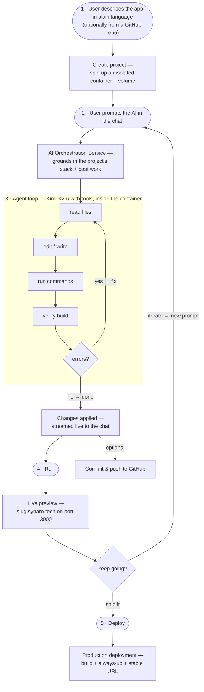
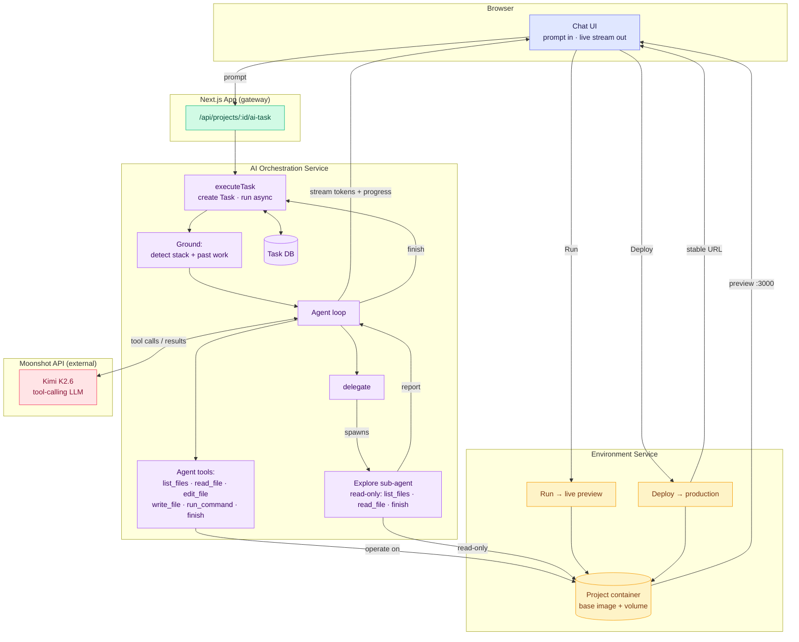
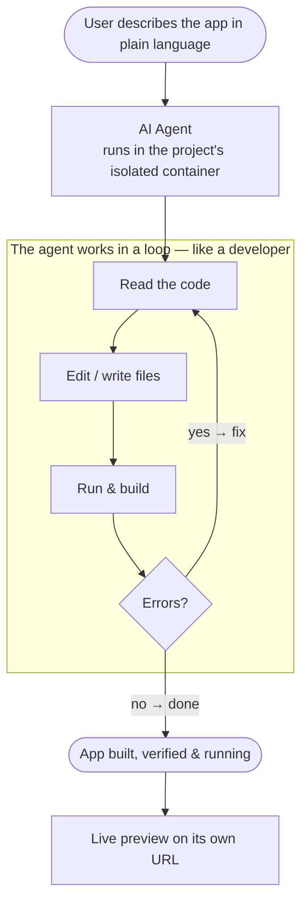
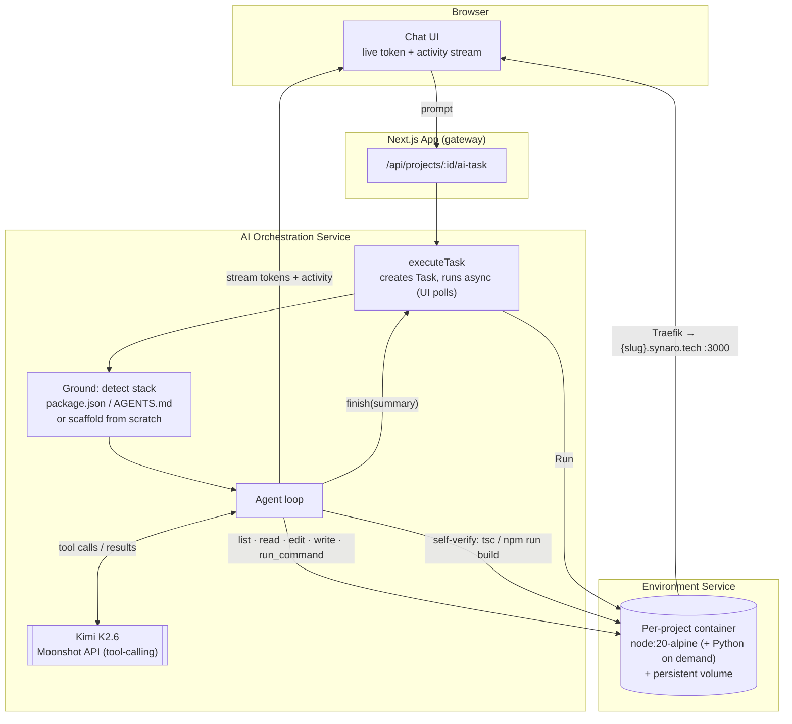
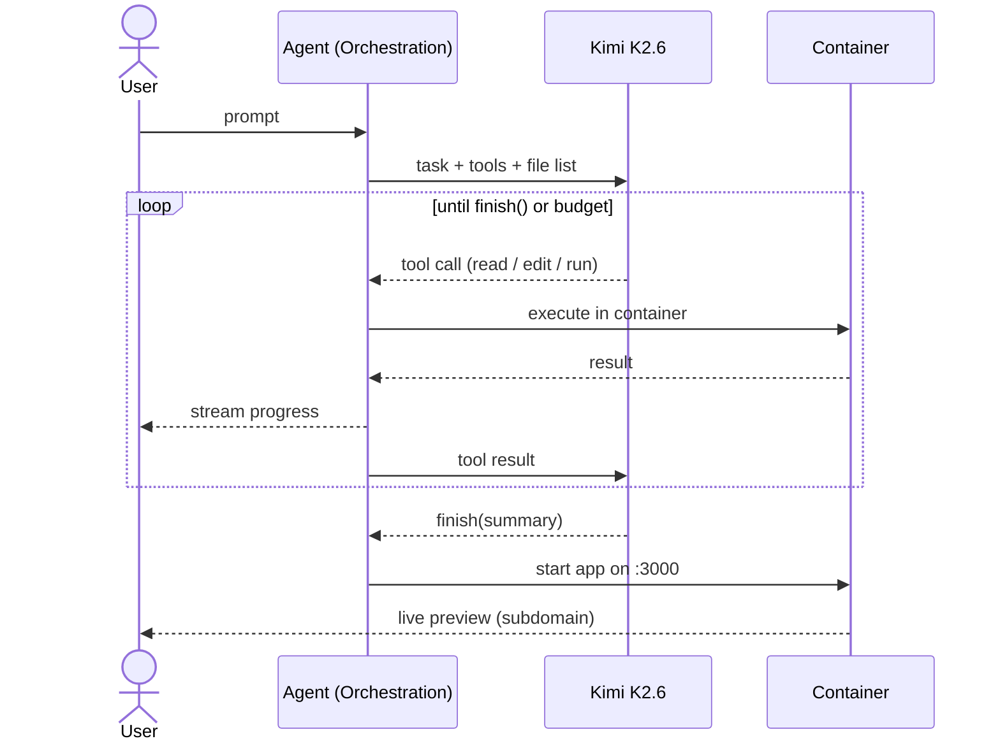
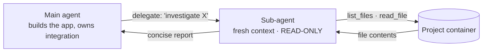

# How Synaro generates projects (presentation diagrams)

Mermaid source for slides. Paste any block into mermaid.live, GitHub, Notion, or a slide tool that
supports Mermaid.

---

## Full project workflow (one diagram)

The whole lifecycle: describe → generate → run → iterate → deploy.

**Say this:** "A user describes an app; we spin up an isolated container for it. Every prompt goes to
the orchestration service, which grounds itself in the project and runs an AI agent that reads, edits,
runs, and verifies the code — looping until it works. The result streams back live. The user runs it
for an instant preview, keeps iterating, and when it's ready, deploys it to an always-up production URL."

---

## Full workflow — color-coded by service (with tools + sub-agent)

Colors = which service each part belongs to:
🟦 Browser · 🟩 Next.js App · 🟪 AI Orchestration Service · 🟨 Environment Service · 🟥 Moonshot API (external)

---

## Layer 1 — High-level (for the jury)

**Say this:** "You describe the app in plain language. An AI agent then works inside an isolated
container the way a developer does — reads the code, edits it, runs the build, and fixes its own
errors — looping until the app actually works and is running live. And you watch the whole thing happen."

---

## Layer 2 — Detailed technical

### 2a. Architecture + data flow

### 2b. The agent loop (sequence)

**Say this:** "The model runs as an agent with tools backed by the real container. Each step it calls a
tool, we execute it, and feed the result back — reading before editing, and verifying the build before
finishing. It's an observe → act → observe → adapt loop with real feedback, which is far more reliable
than generating the whole app in one shot."

### 2c. Sub-agents (the `delegate` tool — optional, flag-gated)

**Say this:** "For a large or unfamiliar codebase, the main agent can hand a bounded, read-only
investigation to a sub-agent — 'find how routing works' — which explores in its own separate context
and returns just a concise report. The main agent stays focused and keeps one coherent view, so we get
the scalability of multiple agents on the parts where it's safe, without the inconsistency that breaks
naïve multi-agent code generation." *(Flag-gated, off by default.)*

---

## Legend (slide-side notes)

**Tools the agent uses** — all backed by the container:
`list_files` · `read_file` · `edit_file` · `write_file` · `run_command` · `finish`
(+ optional `delegate` → a read-only exploration sub-agent, flag-gated)

**What makes it reliable:**
- Isolated container + volume per project
- Streams live (you see every step)
- Self-verifies (runs the build, fixes its own errors)
- Resilient: stall watchdog, per-step timeout keeps partial work, context pruning, tolerant edit-matching, cancellable
- Safe by design: the agent path is flag-gated with a Docker fallback

**Model:** Kimi K2.6 — an agentic, tool-calling LLM — via the Moonshot API.
